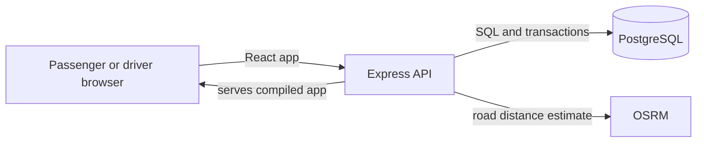

# Dhaka Tesla Pool

Dhaka Tesla Pool is a ride-pooling MVP built around an electric rickshaw-style vehicle. Each vehicle has one driver seat and **two passenger seats**. Passengers can request a trip, see their own route, fare and status, and review trip history. Drivers can choose which compatible pool to accept and update it through its trip lifecycle.

The seeded demo follows the brief's cast: Jashim drives Bullet; Nusrat, Rafiq and Shirin are passengers.

## Features

- Passenger and driver account creation and sign-in. The form explains invalid email addresses, duplicate accounts and passwords shorter than 10 characters. Passwords can be shown or hidden.
- A new driver account receives a Bullet vehicle with two passenger seats.
- Passenger ride requests support one or two passenger seats, fare estimates, Cash or simulated TeslaPay, ride history and cancellation before a trip starts.
- The driver can go online or offline, select a pool, mark arrival, start the trip and complete it.
- Two ride requests can share a pool when they travel in the same direction across at least one common segment of the defined area sequence. A pool never exceeds two passenger seats or two ride requests.
- Each passenger sees their own ride, fare and status. Status and fare changes are recorded in trip history.
- Profile page, clear sign-out button, responsive layout and per-tab sign-in sessions.

## Technology and architecture

- **Frontend:** React and Vite.
- **Backend:** Node.js and Express.
- **Database:** PostgreSQL with parameterized SQL through `pg`.
- **Local runtime:** Docker Compose runs PostgreSQL, applies database migrations, seeds the demo accounts and starts the app.
- **Road distance:** the OSRM driving service estimates area-center-to-area-center distances for fare calculation.

In Docker, the React build and API are served from `http://localhost:5000`. During local development, Vite serves the frontend on port 5173 and proxies API requests to Express on port 5000.
