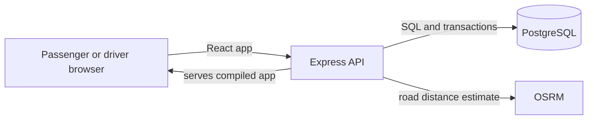

# Dhaka Tesla Pool

Dhaka Tesla Pool is a ride-pooling MVP built around an electric rickshaw-style vehicle. Each vehicle has one driver seat and **two passenger seats**. Passengers can request a trip, see their own route, fare and status, and review trip history. Drivers can choose which compatible pool to accept and update it through its trip lifecycle.

The seeded demo follows the brief's cast: Jashim drives Bullet; Nusrat, Rafiq and Shirin are passengers.

## Features

- Passenger and driver account creation and sign-in. The form explains invalid email addresses, duplicate accounts and passwords shorter than 10 characters. Passwords can be shown or hidden.
- A new driver account receives a Bullet vehicle with two passenger seats.
- Passenger ride requests support one or two passenger seats, fare estimates, Cash or simulated TeslaPay, ride history and cancellation before a trip starts.
- The driver can go online or offline, select a pool, mark arrival, start the trip and complete it.
- Two ride requests can share a pool when they travel in the same direction across at least one common segment of the defined area sequence. A pool never exceeds two passenger seats or two ride requests.
- Each passenger sees their own ride, fare and status. Status and fare changes are recorded in trip history.
- Profile page, clear sign-out button, responsive layout and per-tab sign-in sessions.

## Technology and architecture

- **Frontend:** React and Vite.
- **Backend:** Node.js and Express.
- **Database:** PostgreSQL with parameterized SQL through `pg`.
- **Local runtime:** Docker Compose runs PostgreSQL, applies database migrations, seeds the demo accounts and starts the app.
- **Road distance:** the OSRM driving service estimates area-center-to-area-center distances for fare calculation.



In Docker, the React build and API are served from `http://localhost:5000`. During local development, Vite serves the frontend on port 5173 and proxies API requests to Express on port 5000.

## Area order, matching and fares

The simplified matching corridor uses this sequence:

**Uttara → Mirpur → Banani → Gulshan → Bashundhara → Mohakhali → Farmgate → Dhanmondi**

Requests can share a pool only if both trips travel in the same direction and overlap on at least one segment of that sequence. The implemented examples are:

- Uttara → Mohakhali with Uttara → Mohakhali: compatible.
- Uttara → Gulshan with Mirpur → Gulshan: compatible.
- Uttara → Bashundhara with Banani → Farmgate: compatible.
- Farmgate → Dhanmondi with Dhanmondi → Mohakhali: incompatible because they travel in opposite directions.

The driver sees available pools and chooses which one to accept. A pool stops accepting requests when the driver accepts it. The driver can have only one active pool at a time. Passengers who cannot share a route remain in separate pools.

Matching uses the ordered corridor above; **fare distance is calculated separately** from OSRM driving routes between the selected area centers. It is not calculated by counting area names. Since requests choose areas rather than exact addresses, the quoted road distance is an estimate. For example, a current OSRM route from the Uttara area center to the Mirpur area center is about 7.5 km; routing and exact pickup addresses can change the distance.

Fare formula:

```text
base fare                 = 5,000 paisa (৳50)
distance charge           = 1,800 paisa (৳18) × routed road kilometres
individual fare per seat  = base fare + distance charge
shared fare per seat      = 80% of individual fare per seat, rounded to a paisa
ride total                = per-seat fare × requested seats
```

Money is stored as integer paisa. The route distance and fare are saved with each ride so a later routing estimate does not change past trip records. The 20% discount applies when a ride joins a compatible shared pool. Traffic, tolls and real payments are not included; TeslaPay is a recorded demo choice only.

## Data model

```mermaid
erDiagram
  USERS ||--o{ RIDE_REQUESTS : requests
  USERS ||--o| VEHICLES : drives
  VEHICLES ||--o{ POOLS : runs
  POOLS ||--o{ POOL_MEMBERS : groups
  RIDE_REQUESTS ||--o| POOL_MEMBERS : occupies
  RIDE_REQUESTS ||--o{ STATUS_EVENTS : records
  USERS ||--o{ STATUS_EVENTS : acts

  USERS {
    uuid id PK
    text name
    text email UK
    text role
  }

  VEHICLES {
    uuid id PK
    uuid driver_id FK
    text name
    int capacity
  }

  POOLS {
    uuid id PK
    uuid vehicle_id FK
    text status
    jsonb route_plan
  }

  RIDE_REQUESTS {
    uuid id PK
    uuid passenger_id FK
    uuid pool_id FK
    text pickup_zone
    text destination_zone
    int seats
    int fare_paisa
    int route_distance_m
    text status
  }

  POOL_MEMBERS {
    uuid pool_id FK
    uuid ride_id FK
    int seats
  }

  STATUS_EVENTS {
    bigint id PK
    uuid ride_id FK
    uuid pool_id FK
    text from_status
    text to_status
  }

PostgreSQL transactions and a vehicle-scoped advisory lock serialize ride-pool updates. Before a request joins, the API checks the route rule, request count, occupied seats and vehicle capacity. Driver actions advance both the pool and its member rides through `REQUESTED → MATCHED → DRIVER_ARRIVED → STARTED → COMPLETED`. Eligible passenger cancellations release their seats and are retained in ride history.

## Run locally with Docker Desktop

Prerequisites: Docker Desktop running on Windows.

1. In `D:\DhakaTeslaPool`, copy `.env.example` to `.env` if you do not already have `.env`:

   ```powershell
   Copy-Item .env.example .env
   ```

   The example values work for a local demo; keep private secrets out of public repositories.

2. Open PowerShell in the project folder and run:

   ```powershell
   docker compose up --build -d
   ```

3. Check startup with:

   ```powershell
   docker compose ps
   ```

   Wait for the `app` and `postgres` services to report healthy. The `migrate` and `seed` services stop after completing successfully; `Exited (0)` is normal for those setup jobs.

4. Open [http://localhost:5000](http://localhost:5000).
5. When finished, stop the project with:

   ```powershell
   docker compose down
   ```

   This stops the containers and keeps the named database volume. Run `docker compose up -d` next time to start again. Use `docker compose up --build -d` after changing application code.

Changing `.env` does not rewrite a password inside an already initialized Postgres volume. Keep the volume if it contains rides you need. Removing a volume deletes its database data, so only do that when you intend to reset the local database.

## Demo accounts

| Role               | Email                   | Password        |
| ------------------ | ----------------------- | --------------- |
| Driver (Jashim)    | `jashim@teslapool.test` | `bullet-driver` |
| Passenger (Nusrat) | `nusrat@teslapool.test` | `nusrat-ride`   |
| Passenger (Rafiq)  | `rafiq@teslapool.test`  | `rafiq-ride`    |
| Passenger (Shirin) | `shirin@teslapool.test` | `shirin-ride`   |

These accounts are local demo data. New accounts can be created as either Passenger or Driver. Use an email in a valid format and a password with at least 10 characters. Do not reuse the demo credentials for personal accounts.

## API overview

- `POST /api/auth/signup` — create a passenger or driver account.
- `POST /api/auth/login` — sign in.
- `GET /api/me` — current signed-in account.
- `GET /api/areas` — supported area names in route order.
- `GET /api/fare/estimate?pickup=Uttara&destination=Mirpur&seats=1` — route distance and estimated fare.
- `GET /api/passenger/rides`, `POST /api/passenger/rides` — view or request passenger rides.
- `POST /api/passenger/rides/:id/cancel` — cancel an eligible ride owned by the signed-in passenger.
- `GET /api/driver/pools`, `GET /api/driver/history` — a driver's pools and history.
- `GET /api/driver/status`, `POST /api/driver/status` — read or change driver availability.
- `POST /api/driver/pools/:id/{accept|arrive|start|complete}` — advance a driver's selected pool.
- `GET /api/health` — API and database health.

Passenger and driver API routes require `Authorization: Bearer <token>`. The API gets the account identity and role from the signed token.

## Checks

Run these commands from the project folder:

```powershell
npm --prefix backend test
npm run format:check
npm run build
```

The backend tests cover the documented route-sharing examples, opposite-direction and disjoint routes, two-seat capacity, fares, credential validation and lifecycle rules. They do not replace database-backed tests of signup, authorization or simultaneous requests.

## Project files

```text
backend/server.js                 Express API and database transactions
backend/domain.js                 Areas, fares, account validation and limits
backend/routing.js                OSRM fare routes and corridor matching
backend/migrations/               PostgreSQL schema updates
backend/scripts/seed.js           Jashim, Bullet and passenger demo data
backend/test-domain.js            Backend domain checks
frontend/src/main.jsx             App pages, sign-in and account creation
frontend/src/components/          Passenger ride and driver pool views
frontend/src/utils.js              Area labels and frontend helpers
frontend/src/styles.css            Responsive app styling
Dockerfile                         Frontend build and API runtime image
docker-compose.yml                 PostgreSQL, migrations, seed and app services
```

## Current scope

The route matcher is a simplified ordered corridor, not turn-by-turn navigation. Fare estimates use area centers and require the OSRM routing service. The app does not include real payment processing, live vehicle tracking, traffic-aware fares, exact-address routing, email verification, or password recovery.

## Acknowledgement

ChatGPT and Codex assisted with brainstorming, troubleshooting, code suggestions and documentation. The project author directed product decisions, integrated the implementation and reviewed the application.
