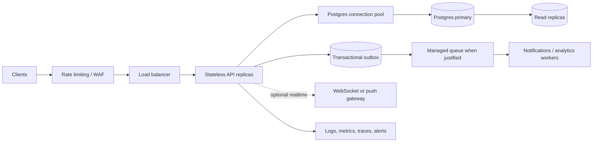

# Scaling notes

The current MVP correctly keeps pool membership transactional. At higher scale, move match finding to geo/zone partitions, add expiring idempotent seat reservations, and route each pool to a single serialization key. Keep the Postgres primary authoritative for confirmed seats. A queue can distribute notifications and analytics, but must not become the capacity authority.
